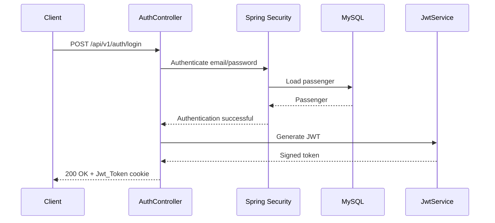

# RideFlow Auth Service

RideFlow Auth Service handles passenger authentication for the RideFlow platform.

It supports:

* passenger registration
* email/password authentication
* JWT generation
* HTTP-only JWT cookies
* protected endpoint validation
* Spring Security integration
* Swagger/OpenAPI documentation

---

## Runtime

| Property          | Value                  |
| ----------------- | ---------------------- |
| Application       | `Rideflow-AuthService` |
| Port              | `8080`                 |
| Database          | MySQL / `uberdb`       |
| Authentication    | Spring Security + JWT  |
| JWT Transport     | `Jwt_Token` cookie     |
| Entity Library    | `0.0.7-SNAPSHOT`       |
| API Documentation | Springdoc OpenAPI      |

There is currently no explicit `server.port` configuration, so Spring Boot uses its default port:

```text
8080
```

---

## Authentication Flow



---

## JWT Validation Flow

```text
GET /api/v1/auth/validate
        ↓
JwtAuthenticationFilter
        ↓
Read Jwt_Token Cookie
        ↓
Extract Passenger Email
        ↓
Load Passenger
        ↓
Validate JWT
        ↓
Create Authentication Object
        ↓
Populate SecurityContext
        ↓
AuthController
```

---

## Swagger / OpenAPI

Swagger UI:

```text
http://localhost:8080/swagger-ui.html
```

OpenAPI JSON:

```text
http://localhost:8080/v3/api-docs
```

OpenAPI YAML:

```text
http://localhost:8080/v3/api-docs.yaml
```

Documented paths:

```text
/api/v1/auth/**
```

Springdoc may redirect:

```text
/swagger-ui.html
```

to:

```text
/swagger-ui/index.html
```

---

## API Reference

Base path:

```text
/api/v1/auth
```

| Method | Endpoint    | Access    | Purpose                     |
| ------ | ----------- | --------- | --------------------------- |
| POST   | `/signUp`   | Public    | Register a passenger        |
| POST   | `/login`    | Public    | Authenticate passenger      |
| GET    | `/validate` | Protected | Validate JWT authentication |

---

# 1. Passenger Sign Up

Endpoint:

```http
POST /api/v1/auth/signUp
```

Example request:

```json
{
  "email": "anita.rideflow@example.com",
  "password": "RideFlowDemo@123",
  "phoneNumber": "9000000001",
  "name": "Anita Sharma",
  "role": "PASSENGER"
}
```

Expected response:

```text
201 Created
```

The passenger information is persisted in MySQL.

---

# 2. Login

Endpoint:

```http
POST /api/v1/auth/login
```

Example request:

```json
{
  "email": "anita.rideflow@example.com",
  "password": "RideFlowDemo@123"
}
```

Expected response:

```text
200 OK
```

A successful login generates a JWT.

The token is returned and also added to a cookie named:

```text
Jwt_Token
```

Typical response flow:

```text
Email + Password
       ↓
AuthenticationManager
       ↓
Passenger loaded
       ↓
Password verified
       ↓
JWT generated
       ↓
Jwt_Token cookie created
       ↓
200 OK
```

---

## JWT Cookie

Authentication uses a cookie named:

```text
Jwt_Token
```

The cookie is configured as HTTP-only.

This helps prevent client-side JavaScript from directly reading the JWT.

For local development, the cookie currently uses:

```text
Secure = false
```

A production HTTPS environment should use:

```text
Secure = true
```

---

# 3. Validate Authentication

Endpoint:

```http
GET /api/v1/auth/validate
```

This endpoint requires a valid JWT cookie.

Successful response:

```text
Success
```

---

## How JWT Validation Works

The current `JwtAuthenticationFilter` runs for the protected validation endpoint.

It performs the following steps:

```text
Request
   ↓
Find Jwt_Token cookie
   ↓
Extract token
   ↓
Extract email from JWT subject
   ↓
Load passenger using email
   ↓
Check JWT signature and expiration
   ↓
Compare JWT email with UserDetails username
   ↓
Create UsernamePasswordAuthenticationToken
   ↓
Store Authentication in SecurityContext
   ↓
Continue filter chain
```

If the cookie is missing or authentication fails, the request is rejected.

---

## JWT Subject

The JWT subject currently contains:

```text
Passenger email
```

Example:

```text
anita.rideflow@example.com
```

The token also contains the passenger role as a claim.

---

## Current JWT Validation Logic

The token is considered valid when:

```text
JWT subject == authenticated passenger email
```

and:

```text
JWT has not expired
```

`PassengerPrinciple.getUsername()` currently returns the passenger email, so the comparison is consistent with the JWT subject.

---

## Spring Security Rules

Public endpoints:

```text
POST /api/v1/auth/signUp

POST /api/v1/auth/login
```

Protected endpoint:

```text
GET /api/v1/auth/validate
```

Swagger/OpenAPI endpoints are also allowed without authentication:

```text
/swagger-ui.html
/swagger-ui/**
/v3/api-docs
/v3/api-docs/**
/v3/api-docs.yaml
```

---

## Testing With Swagger

Start the application and open:

```text
http://localhost:8080/swagger-ui.html
```

Recommended testing sequence:

```text
1. POST /api/v1/auth/signUp
2. POST /api/v1/auth/login
3. GET  /api/v1/auth/validate
```

---

## Testing Authentication Correctly

### Step 1 — Register Passenger

Call:

```text
POST /api/v1/auth/signUp
```

Example:

```json
{
  "email": "anita.rideflow@example.com",
  "password": "RideFlowDemo@123",
  "phoneNumber": "9000000001",
  "name": "Anita Sharma",
  "role": "PASSENGER"
}
```

---

### Step 2 — Login

Call:

```text
POST /api/v1/auth/login
```

Example:

```json
{
  "email": "anita.rideflow@example.com",
  "password": "RideFlowDemo@123"
}
```

Check that the response contains:

```text
Set-Cookie: Jwt_Token=...
```

---

### Step 3 — Validate

Call:

```text
GET /api/v1/auth/validate
```

If the browser/Swagger client sends the stored cookie automatically, the response should be:

```text
Success
```

---

## Negative Testing

Useful authentication tests include:

### Invalid Password

```text
POST /api/v1/auth/login
```

with an incorrect password.

Expected:

```text
Authentication failure
```

---

### Validate Without JWT

```text
GET /api/v1/auth/validate
```

without the `Jwt_Token` cookie.

Expected:

```text
401 Unauthorized
```

---

### Expired JWT

Send an expired token.

Expected:

```text
401 Unauthorized
```

---

### Modified JWT

Modify any part of the JWT manually.

Signature validation should fail.

---

## Database Configuration

Current local database:

```text
uberdb
```

Create it using:

```sql
CREATE DATABASE uberdb;
```

Typical configuration:

```properties
spring.datasource.url=jdbc:mysql://localhost:3306/uberdb
spring.datasource.username=root
spring.datasource.password=root
spring.datasource.driver-class-name=com.mysql.cj.jdbc.Driver
```

Hibernate configuration:

```properties
spring.jpa.hibernate.ddl-auto=update
spring.jpa.show-sql=true
spring.jpa.properties.hibernate.format_sql=true
```

---

## Shared Entity Dependency

Auth Service currently uses:

```gradle
implementation 'com.rideflow:Rideflow-EntityService:0.0.7-SNAPSHOT'
```

and resolves it through:

```gradle
mavenLocal()
```

Therefore EntityService should be published before running Auth Service.

---

## Publish EntityService

From the EntityService project:

### Windows

```bash
gradlew.bat publishToMavenLocal
```

### Linux / macOS

```bash
./gradlew publishToMavenLocal
```

---

## Technology Stack

* Java 17
* Spring Boot 4.1.0
* Spring MVC
* Spring Security
* Spring Data JPA
* Hibernate
* MySQL
* JJWT
* Springdoc OpenAPI
* Lombok
* Gradle
* RideFlow EntityService

---

## Main Dependencies

Important dependencies include:

```text
Spring Web MVC
Spring Security
Spring Data JPA
MySQL Connector
JJWT
Springdoc OpenAPI
Lombok
RideFlow EntityService
```

---

## Project Structure

```text
src/main/java/
└── ...
    ├── advice/
    ├── configuration/
    │   ├── OpenApiConfig.java
    │   └── SpringSecurity.java
    ├── controller/
    │   └── AuthController.java
    ├── dto/
    ├── filters/
    │   └── JwtAuthenticationFilter.java
    ├── mapper/
    ├── repository/
    ├── security/
    ├── service/
    └── RideflowAuthServiceApplication.java
```

---

## Run the Application

### Windows

```bash
gradlew.bat bootRun
```

### Linux / macOS

```bash
./gradlew bootRun
```

Application:

```text
http://localhost:8080
```

Swagger:

```text
http://localhost:8080/swagger-ui.html
```

---

## Run Tests

### Windows

```bash
gradlew.bat test
```

### Linux / macOS

```bash
./gradlew test
```

---

## Security Notes

The current implementation is suitable for local development and learning, but several improvements would be important before production deployment.

### Externalize JWT Secret

The JWT signing secret should not be committed directly in:

```text
application.properties
```

Prefer:

```text
JWT_SECRET
```

through environment configuration.

---

### Externalize Database Credentials

Instead of keeping:

```properties
spring.datasource.username=root
spring.datasource.password=root
```

in source control, use environment variables or secrets management.

---

### Enable Secure Cookies

Production HTTPS deployments should use:

```text
Secure=true
```

for authentication cookies.

---

### Cookie SameSite Policy

A production application should explicitly decide an appropriate:

```text
SameSite
```

policy depending on frontend/backend deployment architecture.

---

## Current Implementation Notes

* Auth Service currently does not register with Eureka.
* Authentication uses JWT stored in the `Jwt_Token` cookie.
* `/signUp` and `/login` are public.
* `/validate` is protected.
* JWT subject is the passenger email.
* The authentication filter validates the token against the passenger's email.
* Swagger/OpenAPI is enabled for `/api/v1/auth/**`.
* Local cookie configuration uses `Secure=false`.
* Development database credentials are currently present in application configuration.
* Security-sensitive values should be externalized before production deployment.

---

## Future Improvements

* refresh-token support
* logout endpoint that clears the JWT cookie
* token revocation strategy
* password reset flow
* email verification
* rate limiting for login attempts
* secure secret management
* production cookie configuration
* integration tests for authentication flows
* centralized authentication through an API Gateway

---

## Parent Project

See the complete RideFlow project:

[RideFlow](https://github.com/Abhilash-Panja/RideFlow)
