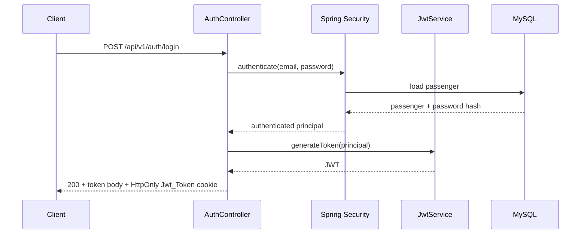

# RideFlow Auth Service

RideFlow Auth Service handles passenger account registration and authentication. It uses Spring Security with JWTs and returns the generated token both in the response body and in an HTTP-only cookie.

## Responsibilities

- register a passenger account
- authenticate a passenger using email/password
- generate JWT access tokens
- set the JWT in an HTTP-only `Jwt_Token` cookie
- validate authenticated requests through a JWT authentication filter
- load passenger data from MySQL through Spring Data JPA

## Runtime

| Property | Value |
|---|---|
| Application name | `Rideflow-AuthService` |
| Default port | `8080` |
| Database | MySQL / `uberdb` |
| Shared model dependency | `com.rideflow:Rideflow-EntityService:0.0.2-SNAPSHOT` |

No explicit `server.port` is currently configured, so Spring Boot's default `8080` is used.

## Authentication Flow



## API

Base path:

```text
/api/v1/auth
```

### Sign Up

```http
POST /api/v1/auth/signUp
Content-Type: application/json
```

Example:

```json
{
  "email": "passenger@example.com",
  "password": "StrongPassword123",
  "phoneNumber": "9876543210",
  "name": "Anita Sharma",
  "role": "PASSENGER"
}
```

The shared `Role` enum currently contains:

```text
PASSENGER
DRIVER
ADMIN
```

Successful creation returns `201 Created`.

### Login

```http
POST /api/v1/auth/login
Content-Type: application/json
```

```json
{
  "email": "passenger@example.com",
  "password": "StrongPassword123"
}
```

On success:

- HTTP status: `200 OK`
- response body contains the JWT
- response header includes an HTTP-only cookie named `Jwt_Token`

Current local configuration builds the cookie with:

- `HttpOnly=true`
- `Secure=false`
- `Path=/`
- expiry controlled by `cookie.expiration-ms`

`Secure=false` is appropriate only for local HTTP development. Production HTTPS should use a secure cookie.

### Validate Authentication

```http
GET /api/v1/auth/validate
```

This route is protected by Spring Security and requires a valid authentication token/cookie.

Current success body:

```text
Success
```

## Security Rules

The current `SecurityFilterChain` permits:

```text
POST /api/v1/auth/signUp
POST /api/v1/auth/login
```

and requires authentication for:

```text
GET /api/v1/auth/validate
```

A custom JWT filter runs before Spring Security's username/password authentication filter.

## Tech Stack

- Java 17
- Spring Boot 4.1.0
- Spring MVC
- Spring Security
- Spring Data JPA / Hibernate
- MySQL
- JJWT 0.13.0
- Lombok
- Gradle
- shared RideFlow EntityService models

## Prerequisites

- JDK 17+
- MySQL
- database `uberdb`
- the required EntityService snapshot available in Maven Local

Because this service currently pins:

```text
com.rideflow:Rideflow-EntityService:0.0.2-SNAPSHOT
```

you must either have that historical snapshot available or update the dependency to a compatible currently published EntityService version.

## Database Setup

Create the database:

```sql
CREATE DATABASE uberdb;
```

Current local configuration uses:

```properties
spring.datasource.url=jdbc:mysql://localhost:3306/uberdb
spring.datasource.username=root
spring.datasource.password=root
spring.jpa.hibernate.ddl-auto=validate
```

For local or deployed environments, prefer overriding configuration externally:

```text
SPRING_DATASOURCE_URL=jdbc:mysql://localhost:3306/uberdb
SPRING_DATASOURCE_USERNAME=root
SPRING_DATASOURCE_PASSWORD=<password>
JWT_SECRET=<strong-secret>
JWT_EXPIRATION_MS=3600000
COOKIE_EXPIRATION_MS=3600000
```

Do not use a checked-in development JWT secret in a deployed environment.

## Run

```bash
# Linux/macOS
./gradlew bootRun

# Windows
gradlew.bat bootRun
```

Build:

```bash
./gradlew clean build
```

Test:

```bash
./gradlew test
```

## Project Structure

```text
src/main/java/com/rideflowauthservice/
├── advice/              # global exception handling
├── configuration/       # security and password encoder configuration
├── controller/          # AuthController
├── dto/                 # auth/passenger/driver/booking DTOs
├── filters/             # JWT authentication filter
├── mapper/              # DTO/entity mapping
├── repository/          # persistence access
├── security/            # authenticated principal and handlers
├── service/             # auth, JWT and user-details services
└── RideflowAuthServiceApplication.java
```

## Integration Notes

- This service currently does **not** register with RideFlow's Eureka server.
- It shares domain classes through `Rideflow-EntityService`.
- It uses the same development `uberdb` database used by several RideFlow services.
- Authentication is currently focused on passenger login/signup.

## API Documentation

This service does not currently include Springdoc/OpenAPI. The REST contract above reflects the checked-in controller implementation.

A natural next step is to add OpenAPI documentation and a Bearer/JWT security scheme.

## Parent Project

See the full system:

[RideFlow](https://github.com/Abhilash-Panja/RideFlow)
